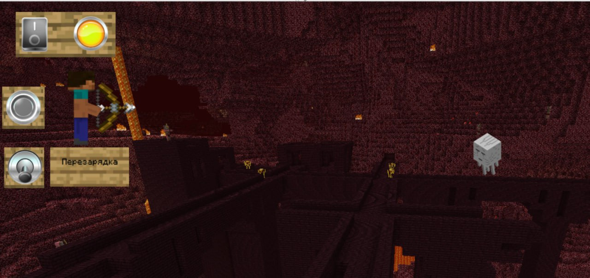

# Игра "Попади в Гаста" на ПЛК Regul R050

---

## Общее описание

Программа реализует игру на программируемом логическом контроллере (ПЛК), в которой:

- На экране движется **мишень — гаст из Minecraft** (движение вверх-вниз).
- Игрок может нажать на кнопку (`triggerButton`), чтобы **выстрелить стрелой из лука**.
- Если выстрел попадает в зону мишени, это считается попаданием и засчитывается очко.
- После попадания происходит пауза, затем гаст продолжает движение.

---

## Краткое описание кода

### 1. Активация системы

- Входной сигнал `gameStartButton` активирует флаг `gameActive`, который включает всю игровую логику.

### 2. Движение гаста

- Мишень (гаст) движется вертикально по координате `targetY`.
- Движение вверх контролируется триггером `moveUp`, вниз — `moveDown`.
- При достижении нижней границы (`targetY <= 0`) включается движение вверх.
- При достижении верхней границы (`targetY >= 250`) включается движение вниз.

### 3. Выстрел

- При нажатии `triggerButton` и при наличии мишени (`targetVisible`), активируется триггер `fireTrigger`.
- Стрела (пуля) создаётся с начальной позицией `bulletX`, `bulletY`.

### 4. Движение стрелы

- Пока `fireTrigger.Q1 = TRUE`, координата `bulletX` увеличивается (движение вправо).
- Если `bulletX > 800`, то есть превышено максимальное расстояние, выстрел считается оконченным, координаты сбрасываются.

### 5. Обнаружение попадания

- Если `bulletX - 750 >= targetX`  
  и `targetY` попадает в диапазон от `bulletY + 40` до `bulletY + 110`, и при этом `targetY > 0`, то:
  - Стрела считается попавшей, её координаты обнуляются (`bulletX := 1000`, `bulletY := 1000`).
  - Активируется `hitTrigger`.
  - Засчитывается попадание.

### 6. Обработка попадания

- При активном `hitTrigger`:
  - Все скорости мишени (`targetSpeedX1–targetSpeedX6`, `targetSpeedY1–targetSpeedY6`) сбрасываются в 0.
  - Запускается таймер `hitPulseTimer` на 2 секунды.
  - По окончании таймера `hitTrigger` сбрасывается, игра продолжается.
  - Если скорости равны нулю — увеличивается счёт `score`.

### 7. Сброс игры

- При активации `resetButton` координаты всех паттернов (`shotMarkX1–shotMarkX5`, `shotMarkY1–shotMarkY5`) сбрасываются —  
  это удаляет визуальные следы попаданий.

---

## Технические детали

- **Автор:** Жуланов Даниил, студент группы АТ-22-01, Губкинский университет.
- **Среда разработки:** Astra.IDE  
- **Язык программирования:** Structured Text (ST) — текстовый язык высокого уровня для ПЛК.
- **Используемые технологии и конструкции:**
  - Триггеры `SR` и `R_TRIG` для обработки событий.
  - Таймеры `TP`, `TON`, `TOF` для задержек и временной логики.
  - Логические условия (`IF...THEN`) для принятия решений.
  - Координатная логика для управления движением объектов и определения попаданий.
- **Графика:**
  - Изображения загружены через **Пул изображений** в Astra.IDE.
  - Визуальные элементы из Minecraft:
    - **Гаст** — мишень, движущаяся по экрану.
    - **Стив** — игрок, совершающий выстрел.
    - **Стрела** — снаряд, выпускаемый Стивом.
    - **Фон** — в стиле ада из Minecraft.
